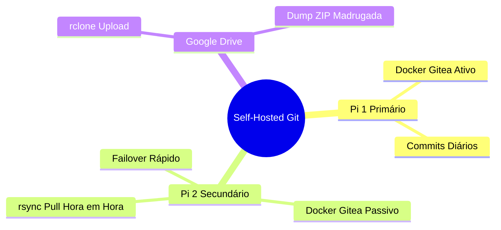

# Self-Hosted Gitea with High Availability & Cloud Backup

Este é um projeto de **Self-Hosting** para criar seu próprio servidor Git local usando Gitea, com redundância local (entre dois Raspberry Pis) e backup off-site automatizado (Google Drive). Esta arquitetura garante que você não perca seu código sob nenhuma circunstância.

## 🚀 Arquitetura (Ativo-Passivo)



1. **Raspberry Pi 1 (Primário):** Roda o Gitea e o banco de dados via Docker. É onde você faz seus *commits* diários.
2. **Raspberry Pi 2 (Secundário/Réplica):** Fica ligado, mas com o Gitea "desligado". Recebe cópias exatas dos dados do Pi 1 constantemente via `rsync`. Se o Pi 1 falhar, você sobe o container no Pi 2 e continua trabalhando.
3. **Google Drive (Cold Backup):** Recebe um arquivo `.zip` (dump) do Gitea todas as madrugadas via `rclone`, garantindo proteção contra perda total.

## 📋 Pré-requisitos

- 2x Raspberry Pis (Recomendado o uso de SSD externo no lugar do MicroSD para o banco de dados)
- IPs fixos configurados no roteador (ex: Pi 1 = `192.168.1.50`, Pi 2 = `192.168.1.51`)
- Docker e Docker Compose instalados no Pi 1 (e idealmente no Pi 2 para o failover)
- `rclone` configurado no Pi 1 conectado à sua conta do Google Drive

## 🛠️ Instalação e Configuração

### 1. Servidor Primário (Pi 1)

1. Clone este repositório no Pi 1:
   ```bash
   git clone https://github.com/seu-usuario/seu-repositorio.git /opt/gitea_server
   cd /opt/gitea_server
   ```
2. Inicie o Gitea:
   ```bash
   docker-compose up -d
   ```
3. O Gitea estará acessível na porta `3000`.

### 2. Sincronização Secundária (Pi 2)

1. Gere uma chave SSH no Pi 2 e adicione no `~/.ssh/authorized_keys` do Pi 1.
2. Configure o cron no Pi 2 para rodar o script `scripts/sync_replica.sh` de hora em hora.
   ```bash
   crontab -e
   # Adicione a linha:
   # 0 * * * * /caminho/do/repositorio/scripts/sync_replica.sh
   ```

### 3. Backup na Nuvem (Google Drive)

1. Instale o `rclone` no Pi 1 e configure um remote chamado `gdrive`.
2. Configure o cron no Pi 1 para rodar o backup toda madrugada.
   ```bash
   crontab -e
   # Adicione a linha:
   # 0 3 * * * /caminho/do/repositorio/scripts/backup_gitea.sh
   ```

## 🚨 Failover (Simulação de Desastre)

Se o Pi 1 quebrar:
1. Acesse o Pi 2.
2. Vá até a pasta mapeada do backup (`/opt/gitea_data_replica/`).
3. Execute `docker-compose up -d`.
4. O Gitea estará de volta no ar usando o IP do Pi 2 com os dados da última sincronização.

## 🔗 Referências Oficiais

- [Raspberry Pi](https://www.raspberrypi.com/)
- [Gitea](https://gitea.io/)
- [Rclone](https://rclone.org/)

## 📝 Licença
Este projeto está sob a licença MIT.
